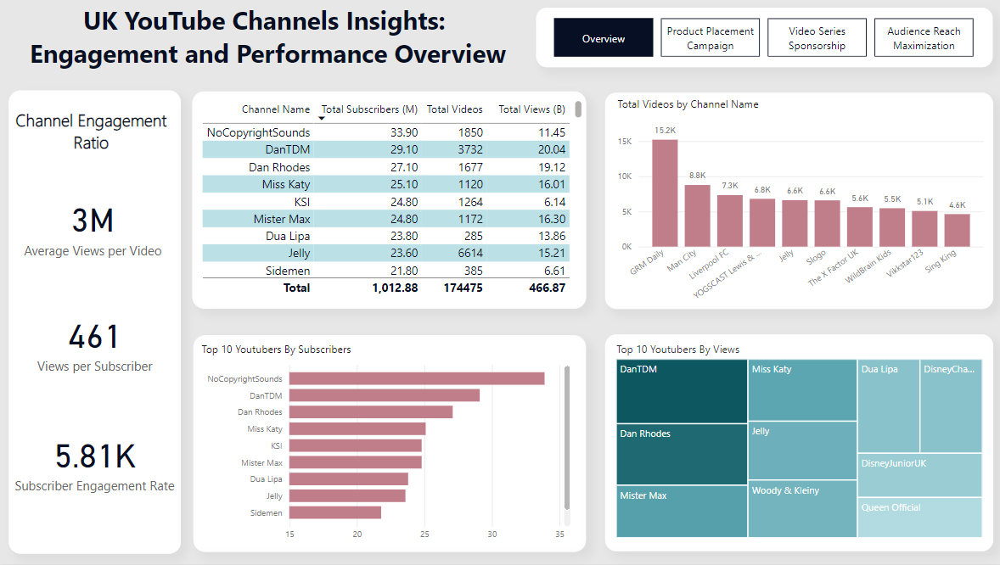
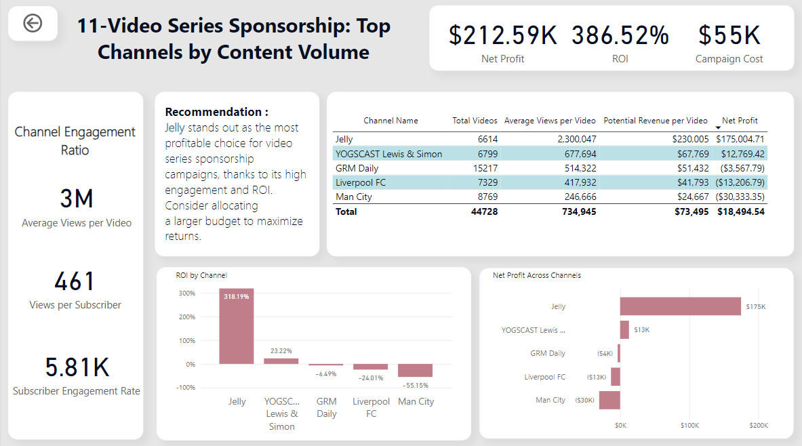

# UK YouTube Channels Insights: Engagement and Performance Overview  

## Overview  
This project analyzes YouTube data from UK-based YouTubers to help the marketing team select the most effective influencers for campaigns. By extracting key metrics and insights, the project enables informed decision-making.  

**Project Goals:**  
- Identify top-performing YouTubers in the UK.  
- Analyze their potential for marketing campaigns.  
- Provide actionable insights using SQL, Python, and Power BI.  

---  

## Workflow  

### 1. Dataset Preparation  
- **Source**: Kaggle dataset (`kggle_youtube_data_united-kingdom.csv`).  
- **Enhancement**: The dataset lacked key information, such as channel names, total views, and video counts. I used the YouTube Data API to enrich the dataset with these metrics.  

### 2. Data Enrichment with Python  
- **Script**: `youtube_api_script.py`  
- **Process**:  
  1. Extracted channel statistics (subscribers, views, videos) using the YouTube Data API.  
  2. Combined the enriched data with the original dataset.  
  3. Output: `python_youtube_data_uk_updated.csv`.  

### 3. SQL Data Preparation  
- **Cleaning**:  
  - Removed unnecessary columns.  
  - Extracted YouTube channel names from IDs.  
  - Standardized column names.  
- **Scripts**:  
  - `sql_data_cleaning.sql`: Data cleaning and view creation.  
  - `sql_quality_checks.sql`: Data quality checks.  

### 4. SQL Analysis  
- Conducted detailed campaign performance analysis in SQL Server.  
- Calculations included potential sales, revenue, and net profit for various campaigns.  
- **Scripts**:  
  - `campaign1.sql`  
  - `campaign2.sql`  
  - `campaign3.sql`  

### 5. Dashboard Creation  
- Developed an interactive Power BI dashboard with:  
  - An overview of channel statistics.  
  - Insights for each campaign type.  
- **DAX Measures**:  
  - **Total Subscribers (M)**: Displays the total subscribers in millions.  
  - **Total Views (B)**: Displays total views in billions.  
  - **Average Views per Video (M)**: Calculates average views per video in millions.  
  - **Subscriber Engagement Rate**: Measures engagement per video.  
  - **Views per Subscriber**: Evaluates the ratio of views to subscribers.  

---  

## Findings  

1. **Top Channels by Subscribers**:  
   - NoCopyrightSounds  
   - DanTDM  
   - Dan Rhodes  

2. **Top Channels by Videos Uploaded**:  
   - GRM Daily  
   - Man City  
   - Liverpool FC  

3. **Top Channels by Views**:  
   - DanTDM  
   - Dan Rhodes  
   - Mister Max  

4. **Engagement Insights**:  
   - Entertainment-focused channels (e.g., Miss Katy, Mister Max, and NoCopyrightSounds) generate the most engagement.  
   - Such channels have strong audience connections, leading to higher profitability for campaigns.  

---  

## Recommendations  

1. **Maximizing Visibility**: Collaborate with Miss Katy and Mister Max. Both channels have large subscriber bases and high profitability.  
2. **Content Creator ROI**: While Jelly and YOGSCAST Lewis & Simon upload regularly, their ROI is lower compared to top channels.  
3. **Secondary Choices**: Dan Rhodes and DanTDM are excellent for long-term collaborations due to high engagement and sustained growth potential.  
4. **Top 3 Channels for Collaboration**:  
   - Miss Katy  
   - Mister Max  
   - Dan Rhodes  

---  

## Power BI Dashboards  

### Overview Dashboard  
  

### Product Placement Campaign  
  

### Video Series Sponsorship  
  

### Audience Reach Maximization  
  

---  

## Technologies Used  
- **Python**: API integration and data processing.  
- **SQL**: Data cleaning, transformation, and analysis.  
- **Power BI**: Visualization of insights and dashboard creation.  
- **DAX**: Dynamic calculations and measures in Power BI.  

